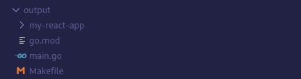

# poc-dev-agents

## Overview

This is a proof of concept for a collection of agents that interact with each other to reach a goal defined by the user, as of now the agents only support the use of ollama and local models.

## Run

```shell
go run . --config sample.config.yaml
2025/05/12 10:45:41 INFO The goal for the project is:  goal="Build a website, this website consists of a single page that displays the string 'Hello, World!', the frontend should be written in React and the backend should be written in Go. The project should be runnable locally using a simple Makefile."
2025/05/12 10:45:41 INFO Spawning agent engine=ollama model=ebdm/gemma3-enhanced:12b agent=project-manager
2025/05/12 10:45:41 INFO Ollama will be available at url=http://127.0.0.1:37559
2025/05/12 10:45:41 INFO Ollama server is ready
2025/05/12 10:45:41 INFO Spawning agent engine=ollama model=ebdm/gemma3-enhanced:12b agent=backend-developer
2025/05/12 10:45:41 INFO Ollama will be available at url=http://127.0.0.1:40421
2025/05/12 10:45:41 INFO Ollama server is ready
2025/05/12 10:45:41 INFO Spawning agent engine=ollama model=ebdm/gemma3-enhanced:12b agent=frontend-developer
2025/05/12 10:45:41 INFO Ollama will be available at url=http://127.0.0.1:41931
2025/05/12 10:45:41 INFO Ollama server is ready
2025/05/12 10:47:35 INFO Adding task task="Create a basic Go server that serves a simple API endpoint (e.g., `/api/hello`). This endpoint should return the string \"Hello, World!\". Set up a basic project structure for the Go backend. Create a `Makefile` entry for running the Go backend." "assigned to"=backend-developer
2025/05/12 10:47:35 INFO Adding task task="Create a new React project using Create React App. Create a component that displays the string \"Hello, World!\". Create a `Makefile` entry for running the React development server." "assigned to"=frontend-developer
2025/05/12 10:47:35 INFO Adding task task="Modify the React component to fetch data from the Go backend's `/api/hello` endpoint and display the result. Ensure the Go backend is accessible from the React frontend (consider CORS if necessary)." "assigned to"=frontend-developer
2025/05/12 10:47:35 INFO Adding task task="Add a target to the Makefile to build and run the entire project (backend and frontend)." "assigned to"=backend-developer
2025/05/12 10:47:40 INFO Scheduling task task="Create a basic Go server that serves a simple API endpoint (e.g., `/api/hello`). This endpoint should return the string \"Hello, World!\". Set up a basic project structure for the Go backend. Create a `Makefile` entry for running the Go backend." to=backend-developer
2025/05/12 10:47:40 INFO Executing task task="Create a basic Go server that serves a simple API endpoint (e.g., `/api/hello`). This endpoint should return the string \"Hello, World!\". Set up a basic project structure for the Go backend. Create a `Makefile` entry for running the Go backend." "assigned to"=backend-developer
2025/05/12 10:49:35 INFO Asking permission to run command command="go mod init example-api" working_directory=output
2025/05/12 10:49:35 INFO Type 'YES' to run the command or 'NO' to skip:
YES
2025/05/12 10:54:26 INFO Running command command="go mod init example-api" working_directory=output
2025/05/12 10:54:26 INFO Command output output=""
2025/05/12 10:54:26 INFO Scheduling task task="Create a new React project using Create React App. Create a component that displays the string \"Hello, World!\". Create a `Makefile` entry for running the React development server." to=frontend-developer
2025/05/12 10:54:26 INFO Executing task task="Create a new React project using Create React App. Create a component that displays the string \"Hello, World!\". Create a `Makefile` entry for running the React development server." "assigned to"=frontend-developer
2025/05/12 10:55:23 INFO Asking permission to run command command="npx create-react-app my-react-app" working_directory=output
2025/05/12 10:55:23 INFO Type 'YES' to run the command or 'NO' to skip:
YES
2025/05/12 10:55:28 INFO Running command command="npx create-react-app my-react-app" working_directory=output
2025/05/12 10:56:15 INFO Command output output="\nCreating a new React app in /home/apraglio/Work/poc-dev-agents/output/my-react-app.\n\nInstalling packages. This might take a couple of minutes.\nInstalling react, react-dom, and react-scripts with cra-template...\n\n\nadded 1322 packages in 39s\n\n268 packages are looking for funding\n  run `npm fund` for details\n\nInstalling template dependencies using npm...\n\nadded 18 packages, and changed 1 package in 3s\n\n268 packages are looking for funding\n  run `npm fund` for details\nRemoving template package using npm...\n\n\nremoved 1 package, and audited 1340 packages in 2s\n\n268 packages are looking for funding\n  run `npm fund` for details\n\n8 vulnerabilities (2 moderate, 6 high)\n\nTo address all issues (including breaking changes), run:\n  npm audit fix --force\n\nRun `npm audit` for details.\n\nSuccess! Created my-react-app at /home/apraglio/Work/poc-dev-agents/output/my-react-app\nInside that directory, you can run several commands:\n\n  npm start\n    Starts the development server.\n\n  npm run build\n    Bundles the app into static files for production.\n\n  npm test\n    Starts the test runner.\n\n  npm run eject\n    Removes this tool and copies build dependencies, configuration files\n    and scripts into the app directory. If you do this, you can’t go back!\n\nWe suggest that you begin by typing:\n\n  cd my-react-app\n  npm start\n\nHappy hacking!\n"
2025/05/12 10:56:15 INFO Scheduling task task="Modify the React component to fetch data from the Go backend's `/api/hello` endpoint and display the result. Ensure the Go backend is accessible from the React frontend (consider CORS if necessary)." to=frontend-developer
2025/05/12 10:56:15 INFO Executing task task="Modify the React component to fetch data from the Go backend's `/api/hello` endpoint and display the result. Ensure the Go backend is accessible from the React frontend (consider CORS if necessary)." "assigned to"=frontend-developer
2025/05/12 10:57:00 INFO Scheduling task task="Add a target to the Makefile to build and run the entire project (backend and frontend)." to=backend-developer
2025/05/12 10:57:00 INFO Executing task task="Add a target to the Makefile to build and run the entire project (backend and frontend)." "assigned to"=backend-developer
...
```

output folder



main.go content

```go
package main

import (
	"fmt"
	"net/http"
)

func helloHandler(w http.ResponseWriter, r *http.Request) {
	fmt.Fprintln(w, "Hello, World!")
}

func main() {
	http.HandleFunc("/api/hello", helloHandler)
	fmt.Println("Server listening on port 8080")
	http.ListenAndServe(":8080", nil)
}
```


